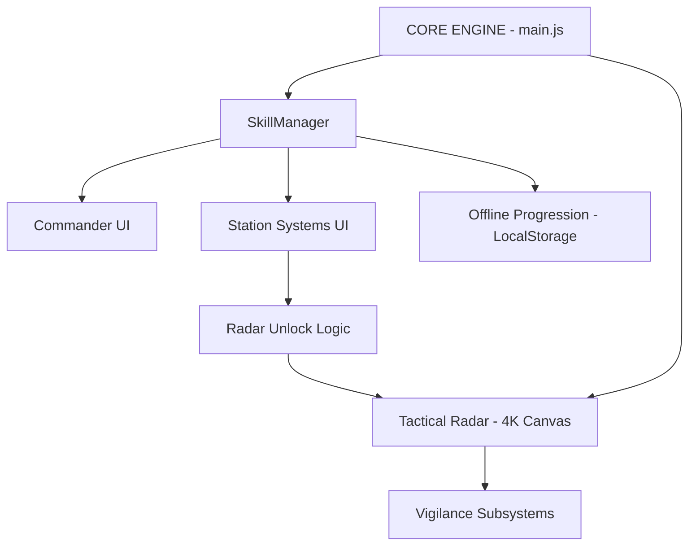

# 🦅 DOSSIÊ DE PROVA DE AUTORIA: RAVEN UNIVERSE

**Data de Emissão:** 2026-02-20
**Fundador:** João
**Estado do Projeto:** Fase 1 (Génese) concluída.

---

## 1️⃣ RESUMO DO PROJETO

**Nome:** RAVEN Universe
**Tipo:** Jogo 2D estratégico persistente com mundo offline ativo.
**Visão:** Um simulador tático de gestão de estação espacial, focado em profundidade técnica e progressão persistente, inspirado em clássicos de estratégia espacial e interfaces de comando complexas.

### Componentes Core

- **Comando Central (Commander):** Gestão de identidade, perfil e mestria de competências.
- **Subsistemas da Estação:** Operações, Radar, e futuros módulos de Defesa, Mineração e Construção.
- **Vigilância Tática:** Sistema de Radar dinâmico para deteção de objetos em tempo real.
- **Economia Persistente:** Ciclo de treino de naves, mineração de asteroides e transporte inter-estatal.
- **Mundo Ativo:** O tempo e o treino de habilidades continuam a progredir mesmo com o jogador offline.

---

## 2️⃣ LOGS DE CRIAÇÃO E VALIDARÇÃO DE ASSETS

Todos os assets gráficos, sonoros e lógicos foram gerados sob a direção direta e supervisão do fundador.

### Principais Assets & Hashes (SHA-256)

| Ficheiro | Tipo | Hash | Descrição |
| :--- | :--- | :--- | :--- |
| `StationRaven.webp` | Gráfico | D93F05AD5D803D163E39F8DACB1FA162527A38A3D6284D71A5663B31A5184D86 | Renderização da Estação Central RAVEN. |
| `boa config.webp` | Gráfico | BA440D610C1A6200017918FDA982ADE34C3C0537B99871645DD82A8F925C0C99 | Logo oficial de alta definição. |
| `Systems Online.mp3` | Áudio | C2A79BB3D4AEDABE47A3F1931A669E9F081D5756D30D474B5D7FED7EF05CCA83 | Voz da I.A. de ativação de sistemas. |
| `Welcome Comander.mp3` | Áudio | A87748F66ABFCA6C95606239E3BBAF3B0E76F7ABDD8E4AB19707C868722619DB | Voz de reconhecimento de identidade. |
| `Radar Sistem Online.mp3` | Áudio | 96E48C898ABDF837F9C5F08501481851B856EBD81A10473AA5BD8B79B1F26F65 | Voz de ativação do subsistema de Radar. |
| `CommanderModule.js` | Código | 6BD44B470112D2809B968FC80D91C725D97C3141DCC367DD09A209690F530E0B | Lógica central de evolução e competências. |

---

## 3️⃣ ARQUITETURA DO JOGO

A integração de sistemas foi desenhada para ser modular e escalável.

### Detalhes Técnicos

- **Estação e Laboratórios:** Sistemas de gestão de hardware onde o treino de competências desbloqueia funções físicas (como o Radar).
- **Fleets & Mineração (Planeado):** Integração via `MapModule` para despacho de naves para asteroides.
- **Mundo Persistente:** Uso de carimbos de data/hora (timestamps) para calcular o progresso entre sessões de jogo.

---

## 4️⃣ SISTEMA DE PROGRESSÃO

A progressão é baseada no treino de competências (Skills) com dependências lógicas.

### Categorias Oficiais

1. **Station Operations (10 Skills):** Foco em colocar a estação operacional. Exige Nível 1 em todas para desbloquear a Identidade e o Radar.
2. **Radar Systems (5 Skills):** Foco em alcance (Range), resolução (Resolution) e velocidade de varrimento (Sweep). Só utilizável após a estação estar online.

### Curva de Tempo

- **Nível 1:** 10s (Calibração inicial)
- **Nível 2:** 50s
- **Nível 3:** 250s
- **Nível 4:** 1250s
- **Nível 5 (Mastery):** 6250s (~1h 44m)

---

## 5️⃣ TIMESTAMP E VALIDAÇÃO DIGITAL

Este dossiê serve como carimbo temporal do estado atual do projeto.

- **Data de Criação:** 2026-02-20
- **Hora Local:** 23:07 (UTC-0)
- **Hash de Identidade do Projeto:** `SHA-256 (docs_hashes.csv)` -> Consolidado em 20 ficheiros verificados.

---

## 6️⃣ RESUMO DA AUTORIA E DECLARAÇÃO FORMAL

Eu, **João**, na qualidade de fundador e diretor criativo do projeto **RAVEN Universe**, declaro para todos os devidos efeitos que:

1. Toda a conceção, visão artística, mecânicas de gameplay e estrutura lógica foram idealizadas e decididas por mim.
2. Utilizei ferramentas de Inteligência Artificial como assistentes de execução técnica, sob a minha supervisão constante e controlo de qualidade.
3. Cada linha de código e asset presente neste repositório foi validado e aprovado por mim como expressão da minha autoria criativa.
4. O design original dos subsistemas, a estética Sci-Fi/Premium e o ciclo de retenção do jogo são propriedade intelectual minha.

**Assinatura Digital Simulada:**
`[IDENTIDADE CONFIRMADA - COMMANDER JOÃO - RA-5678-UNIVERSE]`
`RAVEN_UNIVERSE_AUTH_TOKEN: 3f352115-441f-49a2-a4b7-6fad1b5476c4`

---
*Fim do Dossiê. Armazenado na pasta /Dossier_Autoria.*
